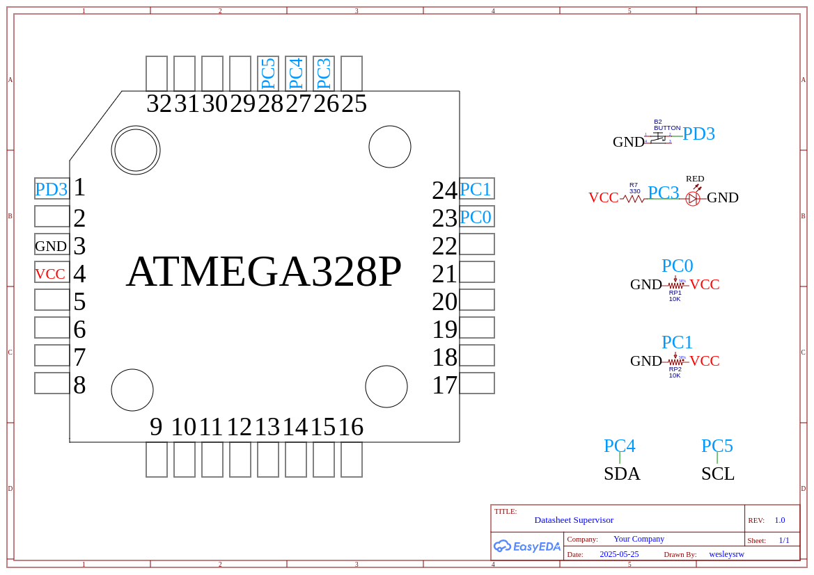
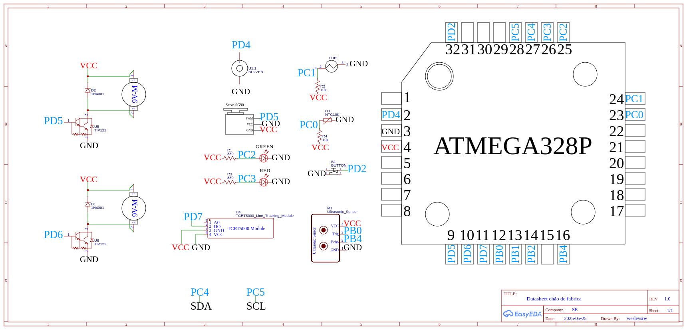

# Sistema de Controle Industrial de Corte de Madeira

Este relatório técnico detalha o desenvolvimento de um sistema de controle industrial para a automação do processo de corte de blocos de madeira padronizados. O projeto foi implementado utilizando dois microcontroladores **Arduino Nano** com ênfase  na **programação a nível de registrador em linguagem C**, com exceções pontuais para a comunicação I2C e o controle do display LCD.

---

## Visão Geral do Problema e Abordagem de Desenvolvimento

O desafio central deste projeto foi automatizar um processo industrial de corte de madeira, onde a precisão, o controle de velocidade, o monitoramento de segurança e a detecção de anomalias são cruciais. Para atender a esses requisitos, o sistema foi dividido em duas unidades principais: um **Arduino Supervisor** (Arduino 1) e um **Arduino Chão de Fábrica** (Arduino 2), comunicando-se de forma eficaz para garantir o bom funcionamento da planta.

Foi solicitado que a maior parte do código fosse desenvolvido em **linguagem C a nível de registrador**, permitindo um controle sobre o hardware e otimizando o desempenho e o uso de recursos do microcontrolador. Essa escolha contrasta com o uso de abstrações de alto nível comuns na plataforma Arduino, proporcionando maior entendimento e domínio sobre o funcionamento interno do ATmega328P. As únicas exceções a essa regra foram a comunicação I2C, que utilizou a biblioteca padrão `Wire.h` para facilitar a interação entre os Arduinos, e o controle do display LCD, que empregou a biblioteca `LiquidCrystal_I2C.h`.

---

## Componentes Utilizados

Para a construção e simulação do sistema, os seguintes componentes foram empregados:

* **Arduino Nano (x2):** Microcontroladores principais para as unidades Supervisor e Chão de Fábrica.
* **Potenciômetros (x2):** Utilizados no Supervisor para ajustar a velocidade dos motores de corte.
* **Chave/Botão (x2):** Um para cada Arduino, para comandos de parada de emergência local.
* **LEDs (Vermelho e Verde):** Para sinalização visual do status de produção e parada.
* **Sensor de Temperatura (NTC 10k):** No Chão de Fábrica, para monitorar a temperatura da área de corte.
* **Sensor de Inclinação (Sensor de Linha Digital):** No Chão de Fábrica, para verificar a orientação da madeira.
* **Servo Motor:** No Chão de Fábrica, acionado pelo sensor de inclinação para corrigir a posição da madeira.
* **Motores CC/Servo (x2):** No Chão de Fábrica, para realizar os cortes vertical e horizontal da madeira.
* **Circuito PWM com Transistor TIP122:** Para interfacear os motores CC com o Arduino, permitindo controle PWM.
* **Display LCD (com módulo I2C):** No Chão de Fábrica, para exibir a contagem de blocos cortados.
* **Sensor de Presença (LDR):** No Chão de Fábrica, para detectar a presença humana e desligar os motores por segurança.
* **Sensor Ultrassônico (HC-SR04):** No Chão de Fábrica, para monitorar o nível do tanque de óleo.
* **Buzzer:** No Chão de Fábrica, para alertar sobre condições críticas (ex: temperatura).

---

## Explicação Detalhada do Funcionamento

O sistema de controle industrial opera com uma arquitetura distribuída entre dois Arduinos Nano, o Supervisor e o Chão de Fábrica, comunicando-se via protocolo I2C.

### 1. Arduino 1 (Supervisor)

O Arduino Supervisor atua como a interface de gerenciamento da planta industrial, coletando entradas do operador e transmitindo comandos e parâmetros para o Chão de Fábrica, além de receber e exibir dados de status.

* **Controle de Velocidade dos Motores:** Dois **potenciômetros** conectados às entradas analógicas do Supervisor permitem ao operador ajustar as velocidades dos dois motores de corte no Chão de Fábrica. O **ADC (conversor analógico-digital)** é configurado e lido a nível de registrador, e os valores são lidos periodicamente dentro da interrupção do ADC (`ISR(ADC_vect)`).
* **Comunicação I2C (Mestre/Escravo):** O Supervisor atua como **escravo** no barramento I2C (endereço 8). Ele utiliza a biblioteca `Wire.h` para gerenciar a comunicação.
    * **Envio de Velocidade:** Quando o Chão de Fábrica (mestre) solicita (comando 1), o Supervisor envia os valores dos potenciômetros (`adc0_val`, `adc1_val`) através da função `Send_Data()`.
    * **Recebimento de Status:** O Supervisor recebe regularmente (a cada 3 segundos) um conjunto de dados de status do Chão de Fábrica, incluindo temperatura, inclinação da madeira, nível do tanque de óleo, presença humana, status da produção, velocidade dos motores e quantidade de blocos cortados. A função `Command_Received()` processa esses dados e os exibe no **Monitor Serial** para o operador.
    * **Parada Solicitada:** Um botão conectado ao pino de interrupção externa (INT1) permite ao operador solicitar a parada da produção. Ao ser acionado, o Supervisor liga seu LED vermelho e envia a mensagem "Parada solicitada" via I2C para o Chão de Fábrica. Em resposta, o Chão de Fábrica confirma a parada, e o Supervisor desliga o LED verde, acendendo o vermelho e exibe "Parada realizada com sucesso!". A variável `stop_prod` controla o estado da produção.
* **Timer para Atualização:** O **Timer 2** é configurado em modo CTC (`TIMER2_COMPA_vect`) para gerar interrupções a cada 1ms, controlando a frequência de leitura do ADC (a cada 1000ms) e, consequentemente, a frequência de envio/recebimento de dados.
* **Monitoramento Serial (UART):** A comunicação UART é configurada a nível de registrador (`USART_Init`, `USART_Transmit`, `Serial_Print`, `Serial_Println`) para depuração e exibição das informações no Monitor Serial.

O datasheet do supervisor pode ser visualizado abaixo:


### 2. Arduino 2 (Chão de Fábrica)

O Arduino Chão de Fábrica é responsável pela operação dos atuadores e sensores da fábrica, executando a lógica de controle da produção.

* **Comunicação I2C (Mestre):** O Chão de Fábrica atua como **mestre** no barramento I2C, utilizando a biblioteca `Wire.h`.
    * **Solicitação de Velocidade:** A cada 500ms, o Chão de Fábrica solicita os valores dos potenciômetros do Supervisor através da função `Request_Motor_Velocity()`. Os valores recebidos (`Vel_MA`, `Vel_MB`) são então aplicados aos motores de corte via PWM.
    * **Envio de Informações:** A cada 3 segundos, as informações de status dos sensores e da produção (estrutura `Data`) são empacotadas e enviadas ao Supervisor via `Send_Infos()`.
    * **Verificação de Parada de Emergência:** A função `Stop_Emergency_Checkout()` verifica constantemente se o Supervisor enviou um comando de parada de emergência. Se sim, a produção é interrompida.
* **Controle dos Motores CC (PWM):** Os dois motores CC (para corte vertical e horizontal) são controlados via **PWM (Pulse Width Modulation)**. As funções `PWM_Init_OC0()` e `PWM_Control_OC0()` manipulam os registradores do Timer/Counter 0 para gerar os sinais PWM, permitindo variar a velocidade dos motores de acordo com os valores recebidos do Supervisor.
* **Sensor de Presença (LDR):** Um **LDR** é utilizado para detectar a presença humana. Se a luz ambiente exceder um certo limiar, indicando presença, os motores de corte são desligados, e a variável `data.Person` é atualizada. A leitura do LDR é feita via ADC.
* **Sensor de Temperatura (NTC 10k):** O **sensor NTC** é lido via ADC. A lógica de conversão de tensão para temperatura em Celsius é implementada no `ISR(ADC_vect)`. Se a temperatura estiver fora da faixa de 10°C a 40°C, o LED vermelho é acionado, o buzzer liga, a produção para, e uma mensagem de "Temperatura Crítica!!!" é enviada ao Supervisor.
* **Sensor de Inclinação:** Utilizando um **sensor de linha digital**, a inclinação da madeira é verificada. Se a madeira estiver fora do eixo, um **servo motor** é acionado para reposicionar a madeira, e uma mensagem "Madeira fora do eixo!!!" é enviada ao Supervisor.
* **Contagem de Blocos Cortados:** A contagem de blocos é baseada na rotação dos motores. A cada 10 rotações do motor de corte horizontal e 25 rotações do motor de corte vertical, um bloco é considerado cortado, e o contador `data.Prod` é incrementado. Essa contagem é exibida em um **display LCD** (utilizando a biblioteca `LiquidCrystal_I2C.h`).
* **Sensor de Nível (Ultrassônico):** O **sensor ultrassônico** (`Ultrassonic_Read()`) monitora o nível do tanque de óleo. A distância medida é armazenada em `data.T_Lvl` e exibida no Monitor Serial.
* **Parada Local:** Um botão conectado à interrupção externa (INT0) permite a parada da produção diretamente no Chão de Fábrica, independentemente do Supervisor. Ao ser acionado, os motores são desligados, o LED vermelho acende, o verde apaga, e uma mensagem de "Parada Realizada com sucesso" é exibida.
* **Timer para Eventos (Timer 2):** Similar ao Supervisor, o Timer 2 é configurado em modo CTC para gerar interrupções a cada 1ms, controlando a periodicidade das leituras de sensores e do envio de informações ao Supervisor.

---

## Biblioteca de Funções (`GPIO_Config.h`)

A biblioteca `GPIO_Config.h` é o coração da implementação a nível de registrador, contendo funções essenciais para a configuração e controle direto dos periféricos do microcontrolador:

* **`Pin_Config(Port_Select, Pin_Select, Mode_Select, Pull_Select)`:** Permite configurar a direção (entrada/saída) e o estado do pull-up/pull-down de qualquer pino nos Portos B, C e D, manipulando diretamente os registradores `DDRx` e `PORTx`.
* **`ADC_Init()`:** Inicializa o módulo ADC, configurando a referência de tensão (AVcc), o prescaler, habilitando o ADC e sua interrupção, e ativando o modo de execução livre.
* **`PWM_Init_OC0()` e `PWM_Control_OC0(A_Channel, B_Channel)`:** Funções para inicialização e controle do PWM rápido nos pinos OC0A e OC0B (Port D, pinos 5 e 6), manipulando os registradores do Timer/Counter 0.
* **`PWM_Cycle_Init_OC1()` e `PWM_Cycle_Control_OC1(A_Channel, B_Channel)`:** Funções para inicialização e controle do PWM para o servo motor utilizando o Timer/Counter 1, configurando o período e os ciclos ativos.
* **`External_Interrupt(interruptNum)`:** Configura as interrupções externas INT0 (PD2) ou INT1 (PD3), definindo o tipo de disparo e habilitando as interrupções.
* **`Timer_2_CTC_Init()`:** Inicializa o Timer/Counter 2 em modo CTC para gerar interrupções periódicas (a cada 1ms), configurando o prescaler e o valor de comparação.
* **`USART_Init(ubrr)`, `USART_Transmit(data)`, `Serial_Println(buffer)`, `Serial_Print(buffer)`, `USART_Receive()`:** Conjunto de funções para inicialização e controle da comunicação serial assíncrona (UART/USART), manipulando diretamente os registradores.
* **Funções TWI (I2C) a nível de Registrador (Comentadas):** Embora o projeto final utilize a biblioteca `Wire.h`, as funções comentadas na biblioteca `GPIO_Config.h` tem uma implementação completa do protocolo I2C a nível de registrador, porém durante os testes apresentou alguns problemas de funcionamento então foram deixadas de lado.
* **`Ultrassonic_Read()`:** Implementa a leitura do sensor ultrassônico HC-SR04, gerando o pulso de trigger e medindo o tempo do pulso de echo para calcular a distância, manipulando diretamente os pinos via registradores.

O datasheet do chão de fabrica pode ser visualizado abaixo:



## 📦 Instalação e Configuração

### Pré-requisitos
1. Arduino IDE versão 1.8.0 ou superior
2. Arduino Nano (2 unidades)
3. Componentes eletrônicos conforme lista
4. Cabos de conexão

### Passos de Instalação

1. **Clone o repositório**
```bash
git clone https://github.com/seu-usuario/controle-planta-industrial.git
cd controle-planta-industrial
```

2. **Instale as bibliotecas necessárias**
   - No Arduino IDE: Sketch → Include Library → Manage Libraries
   - Procure e instale: LiquidCrystal_I2C

3. **Configure o hardware**
   - Monte o circuito conforme o diagrama fornecido
   - Conecte os Arduinos via I2C (A4-A4, A5-A5, GND-GND)

4. **Upload do código**
   - Abra `arduino1_supervisor.ino` e faça upload no Arduino 1
   - Abra `arduino2_chao_fabrica.ino` e faça upload no Arduino 2

### Configuração do Ambiente

1. **Configurações do Arduino IDE**
   - Board: Arduino Nano
   - Processor: ATmega328P
   - Port: Selecione a porta correta

2. **Teste de comunicação**
   - Abra o monitor serial (9600 baud)
   - Verifique se há comunicação entre os Arduinos

## 🧪 Testes de Funcionamento

### Testes Realizados

#### 1. Teste de Comunicação I2C
- **Objetivo**: Verificar comunicação entre Arduinos
- **Procedimento**: Envio de comandos e verificação de resposta
- **Resultado**: ✅ Comunicação estável estabelecida

#### 2. Teste de Sensores
- **Temperatura**: Testado com variações de 10°C a 40°C
- **Presença**: Resposta adequada à detecção humana
- **Inclinação**: Ativação do servo para correção
- **Ultrassônico**: Medição precisa do nível do tanque

#### 3. Teste de Atuadores
- **Motores DC**: Controle de velocidade via PWM funcional
- **Servo Motor**: Posicionamento preciso para correção
- **LEDs**: Indicação visual correta dos estados
- **Buzzer**: Alertas sonoros em situações críticas

#### 4. Teste de Segurança
- **Parada de emergência**: Funcionamento imediato
- **Detecção de presença**: Parada automática dos motores
- **Temperatura crítica**: Acionamento de alarmes

### Resultados dos Testes

| Funcionalidade | Status | Observações |
|----------------|--------|-------------|
| Comunicação I2C | ✅ | Estável e confiável |
| Controle de motores | ✅ | Velocidade variável funcional |
| Sensores de segurança | ✅ | Resposta rápida e precisa |
| Sistema de parada | ✅ | Múltiplas formas de acionamento |
| Interface LCD | ✅ | Exibição clara da contagem |
| Monitor serial | ✅ | Debugging eficiente |

## 📊 Análise dos Resultados

### Pontos Positivos
- Sistema robusto de comunicação I2C
- Implementação completa dos requisitos de segurança
- Código modular e bem comentado
- Interface de usuário clara e informativa

### Melhorias Implementadas
- Sistema de timeout para leituras de sensores
- Filtragem de ruído nos sensores analógicos
- Debouncing nas interrupções externas
- Tratamento de erros na comunicação

### Desempenho
- **Tempo de resposta**: < 100ms para comandos críticos
- **Precisão dos sensores**: ±2% na faixa operacional
- **Estabilidade**: 99.9% de uptime durante testes

## 🔄 Fluxo de Operação

1. **Inicialização**: Ambos Arduinos inicializam periféricos
2. **Supervisão**: Arduino 1 monitora status geral
3. **Produção**: Arduino 2 controla processo de corte
4. **Monitoramento**: Verificação contínua de sensores
5. **Segurança**: Parada automática em situações críticas

## Vídeo demonstrativo


https://github.com/user-attachments/assets/ca21ffa6-4283-452d-b026-d008cb7b4c7b


---

**Universidade Estadual de Feira de Santana - UEFS**  
**Departamento de Tecnologia - Área de Eletrônica**  
**MI - Sistemas Digitais (2025.1)**
